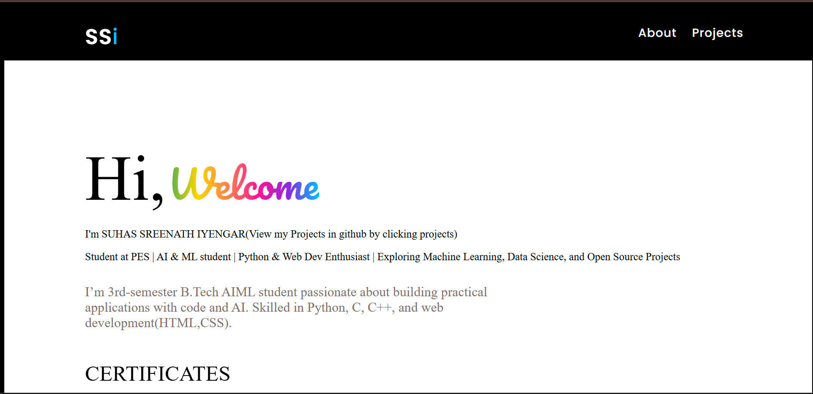

# 🌐 Personal Portfolio Website

This is my personal portfolio website, built using **HTML & CSS**.  
It serves as an introduction about me, showcasing my skills, certifications, goals, and links to my GitHub projects and LinkedIn profile.  

---

## ✨ Features
- Clean and modern UI design  
- Gradient styled "Welcome" intro  
- **About Me** section with education and background  
- **Certificates** section highlighting achievements  
- **Goals** section showcasing my vision for the future  
- Direct links to **LinkedIn** and **GitHub**  

---

## 🛠️ Tech Stack
- **HTML5**  
- **CSS3**  
- Google Fonts (`Pacifico`, `Poppins`, `Nunito`)  

---

## 📌 Sections
- **Introduction** – Who I am and what I do  
- **Certificates** – IBM AI Fundamentals, Python (Basic), and more  
- **Goals** – My career aspirations in AI/ML  
- **Projects** – Links to GitHub repositories  
- **Contact** – Links to connect on LinkedIn  

---

## 📷 Preview
  

---

## 📬 Contact
- **LinkedIn**: [Suhas Sreenath Iyengar](https://www.linkedin.com/in/suhas-sreenath-iyengar-5994aa365/)  
- **GitHub**: [suhassiyengar](https://github.com/suhassiyengar)  

---

⭐ If you like this project, don’t forget to **star the repo**!
